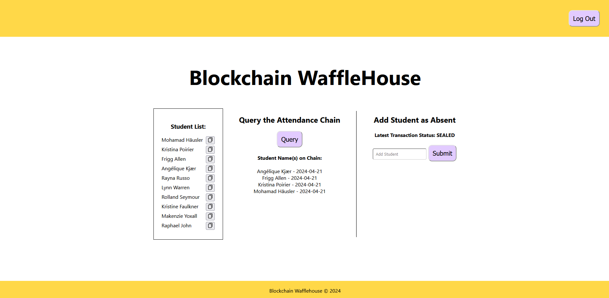

# <Blockchain Wafflehouse>

## Description
Blockchain Wafflehouse (BW) is the premier decentralized application for generating and storing student attendance data.  BW promotes data integrity by utilizing the [Flow]([https://flow.com/](https://flow.com/)) blockchain and Cadence smart contracts to log and store immutable student attendance data.

This application was developed during the April 2024 Web3Apps Hackathon hosted by Major League Hacking (MLH).

## Table of Contents
-  [Features](#features)

-  [Installation](#installation)

-  [Usage](#usage)

-  [Credits](#credits)

-  [Architecture](#architecture)

## Features

- Data storage on the Flow blockchain
- Cadence Smart contracts
- Secure login through Flow Wallet

## Installation

Git clone the main branch from our repository. 

git clone https://github.com/Aryan2892/blockchain-wafflehouse.git

## Usage

Use the package manager npm to install our app.
(for the first run)
npm install

```
npm install
```

### Local with Flow Dev, the Emulator, and Dev Wallet

Run the following to run Flow Dev, the Emulator, and Dev Wallet:

```bash
npm run dev:local
```

Note: Flow Dev will will automatically create new accounts and deploy for you while developing. Your flow.json will be updated automatically. Committing these changes for local development is unncessary.

### Testnet

If you haven't yet created a testnet account, in the CLI run:

```
flow accounts create
```

Follow the steps and select testnet. This will create a `[name].pkey` file (make sure this is gitignored) and add your account to flow.json.

Then in `flow.json`, add the contracts you'd like to be deployed to testnet under this account:

```
// Inside of "deployments"
"testnet": {
  "testnet-account": [
    "HelloWorld"
  ]
}
```

Then run:

```
npm run dev:testnet:deploy
``` 

Whenever you need to redeploy changed contracts to Testnet while seeing the diff between deployed contracts and updates being pushed, you can run:

```
npm run dev:testnet:update
```

Successful installation and login into the Blockchain Wafflehouse module should yield a similar UI:


## Credit 

A lot of our inspiration came from all over the internet as we were looking for examples of Flow projects. We found a tutorial that used a blockchain method to log a greeting and then query the last logged greeting, whether that was "hello world", "hi", "welcome", etc. We changed it to match our idea of an attendance app and made it unique to our project goal.
-This is the link to that online flow tutorial: https://developers.flow.com/build/guides/flow-app-quickstart

## Architecture

This image gives a brief overview of what we have built
